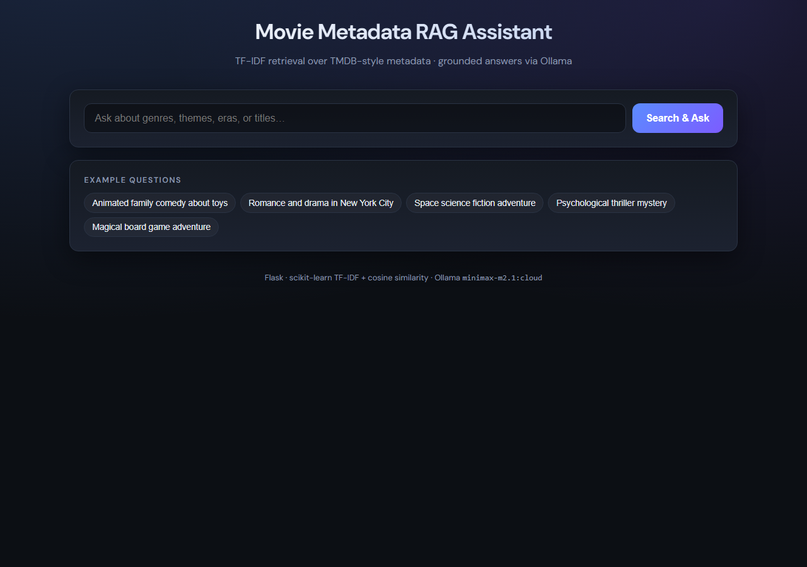
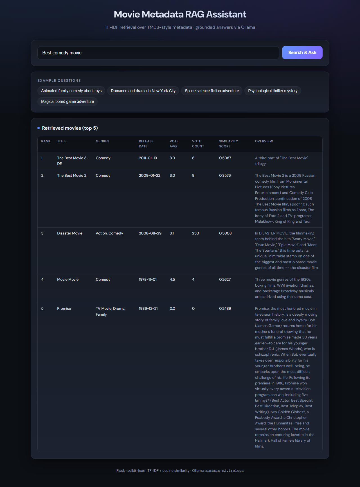
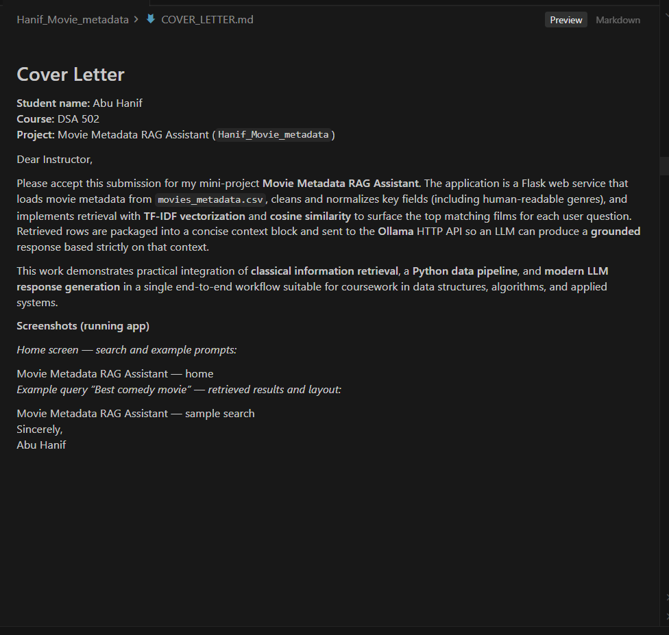
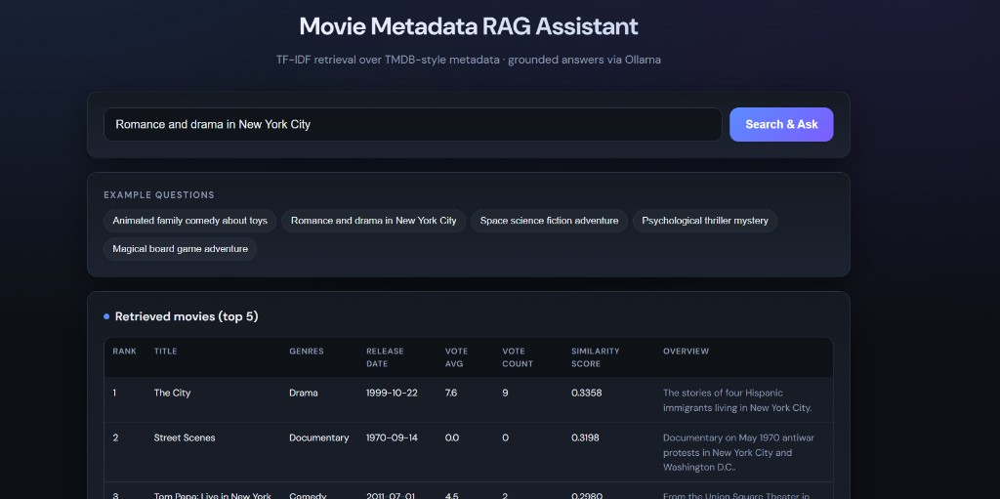
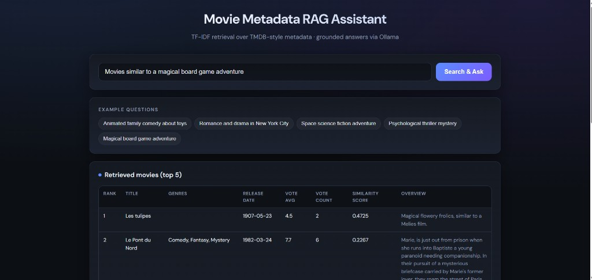

# Cover Letter

**Student name:** Abu Hanif  
**Course:** DSA 502  
**Project:** Movie Metadata RAG Assistant (`Hanif_Movie_metadata`)

Dear Instructor,

Please accept this submission for my mini-project **Movie Metadata RAG Assistant**. The application is a Flask web service that loads movie metadata from `movies_metadata.csv`, cleans and normalizes key fields (including human-readable genres), and implements retrieval with **TF-IDF vectorization** and **cosine similarity** to surface the top matching films for each user question. Retrieved rows are packaged into a concise context block and sent to the **Ollama** HTTP API so an LLM can produce a **grounded** response based strictly on that context.

This work demonstrates practical integration of **classical information retrieval**, a **Python data pipeline**, and **modern LLM response generation** in a single end-to-end workflow suitable for coursework in data structures, algorithms, and applied systems.

## Screenshots (app in the browser)

The following images are **running-app captures** from this project (files live in **`screenshots/`** in the repository).

### Home — search bar and example prompts

### Example: “Best comedy movie” — retrieval table

### Example: “Romance and drama in New York City” — retrieval table

### Example: “Movies similar to a magical board game adventure” — retrieval table

### Example: additional search — retrieval table

Sincerely,  
Abu Hanif
